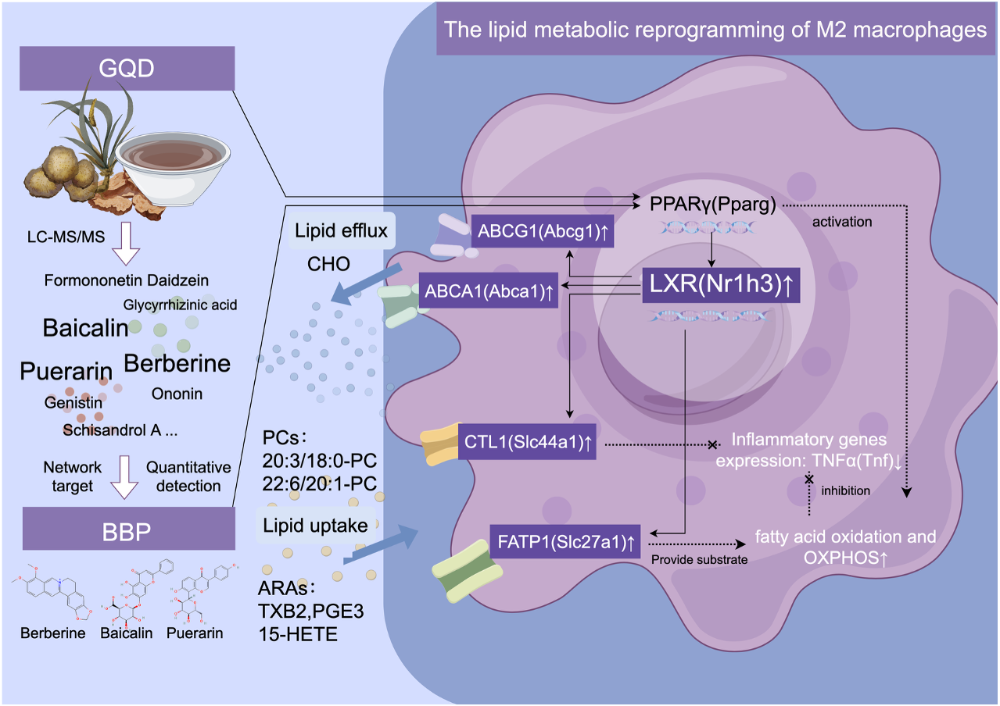

# Analysis_GQD
Analysis Codes for "Uncovering the Nr1h3-mediated lipid metabolic reprogramming of macrophages by Gegen Qinlian Decoction in alleviating meta-inflammation of T2DM"

Database (Single-cell RNA-seq): [ScienceDB](https://doi.org/10.57760/sciencedb.30487)
Database (Target Metabolomics): [ScienceDB](https://doi.org/10.57760/sciencedb.35989)
